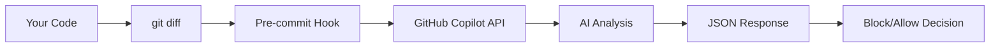

<div align="center">

# 🛡️ AI Code Review CLI

### Catch Security, Bugs & Quality Issues Before They Ship

**A portable, CLI-based AI code review system that performs comprehensive reviews at commit time—powered by GitHub Copilot.**

[](https://opensource.org/licenses/MIT)
[](https://github.com)
[](https://github.com/features/copilot)

<div align="center">


</div>

<br />

[Quick Start](#-quick-start) • [Features](#-features) • [Workflows](#-workflows) • [Configuration](#-configuration) • [Troubleshooting](#-troubleshooting)

<br />

---

</div>

## 💡 The Problem

You're about to commit code with a hardcoded password. Or a SQL injection vulnerability. Or an empty catch block. Or naming convention violations.

**Traditional code reviews catch these issues—days later.** By then, they're already in your codebase, possibly in production.

## ✅ The Solution

This tool intercepts your commits **before they happen**, analyzes your staged changes with AI, and **blocks commits that contain critical security, correctness, or quality issues**.

```
$ git commit -m "Add user authentication"

╔═══════════════════════════════════════════════════════════╗
║  ❌ AI REVIEW: COMMIT BLOCKED                             ║
╚═══════════════════════════════════════════════════════════╝

Found 2 critical issue(s):

  ❌ [BLOCK] src/main/java/UserService.java:42
     Hardcoded database password detected. Use environment 
     variables or a secure configuration management system.

  ❌ [BLOCK] src/main/java/UserService.java:89
     SQL injection vulnerability: query concatenates user input
     directly. Use PreparedStatement with parameterized queries.

Fix these issues or use 'git commit --no-verify' to bypass.
```

**Fix the issue. Commit again. Ship secure code.**

---

## 🔍 What Gets Reviewed

This isn't just a security tool—it's a comprehensive AI code reviewer that checks multiple aspects of your code:


**Review Categories:**

| Category | Severity | Examples |
|----------|----------|----------|
| 🔒 **Security** | BLOCK | Hardcoded secrets, SQL injection, unsafe deserialization |
| 🐛 **Correctness** | BLOCK | Null pointer risks, thread safety issues |
| ⚡ **Performance** | WARN | Inefficient collections, O(n) when O(1) available |
| 📝 **Code Quality** | WARN | Empty catch blocks, poor exception handling |
| 🎯 **Best Practices** | INFO | Naming conventions, Java code standards |

**Severity Levels:**
- **BLOCK**: Commit rejected (security & critical bugs)
- **WARN**: Commit allowed with warnings (quality issues)
- **INFO**: Commit allowed with suggestions (style & conventions)

---

## 🎯 Features

| Feature | Description |
|---------|-------------|
| 🔒 **Comprehensive Reviews** | Checks security, correctness, performance, quality, and best practices |
| 🎯 **Java-Focused Checklist** | YAML-driven rules covering OWASP security + code quality standards |
| ⚡ **Reviews Only Changes** | Analyzes staged diffs, not entire files—fast and focused |
| 🤖 **AI-Powered Analysis** | Leverages GitHub Copilot for intelligent code understanding |
| 🚫 **Smart Blocking** | Only blocks BLOCK-severity issues (security/bugs), allows WARN/INFO |
| 📋 **Strict JSON Output** | Machine-readable results for CI/CD integration |
| 🖥️ **Cross-Platform** | Works on Windows (Git Bash/WSL), macOS, and Linux |
| 🔧 **IDE-Agnostic** | No IDE dependencies—works in any terminal |
| ✏️ **Fully Customizable** | Extend the YAML checklist with your own rules |

---

## 🚀 Quick Start

### Prerequisites

<details>
<summary><strong>1. Install GitHub CLI</strong></summary>

```sh
# Windows
winget install --id GitHub.cli

# macOS
brew install gh

# Linux
# See https://github.com/cli/cli/blob/trunk/docs/install_linux.md

# Then authenticate
gh auth login
```
</details>

<details>
<summary><strong>2. Install Copilot Extension</strong></summary>

```sh
gh extension install github/gh-copilot
```
</details>

<details>
<summary><strong>3. Install jq (JSON parser)</strong></summary>

```sh
# Windows
winget install jqlang.jq

# macOS
brew install jq

# Linux (Debian/Ubuntu)
sudo apt install jq
```
</details>

### Installation

**Option A: Automated (Recommended)**
```sh
./install.sh
```

The script checks dependencies, installs the pre-commit hook, and verifies everything works.

**Option B: Manual**
```sh
cp pre-commit.sh .git/hooks/pre-commit
chmod +x .git/hooks/pre-commit
```

### That's It!

Now every `git commit` triggers an automatic AI review:

```sh
git add src/main/java/MyClass.java
git commit -m "Add new feature"
# AI review runs automatically ✨
```

---

## 🔐 Security & Privacy

> **⚠️ Critical:** This tool sends your code to AI services. For proprietary/corporate code, you **MUST** use GitHub Copilot Business/Enterprise, Azure OpenAI, or local LLMs (Ollama). **Do NOT use free/consumer AI tiers** for confidential code.



### Enterprise vs. Consumer AI Plans

| Aspect | Enterprise/Business Plans | Individual/Free Plans |
|--------|---------------------------|----------------------|
| **Data Retention** | ✅ Prompts discarded immediately after response | ⚠️ May be retained for service improvement |
| **Training Usage** | ✅ Your code is **NOT** used for AI training | ⚠️ May be used to train/improve models |
| **Contractual Protection** | ✅ Data Processing Agreement (DPA), GDPR compliance | ⚠️ Standard consumer terms only |
| **IP Indemnification** | ✅ Often includes IP infringement protection | ❌ Typically not included |

#### ✅ Required for Proprietary Code: Secure AI Options

**For corporate/proprietary codebases, use ONLY these options:**

1. **GitHub Copilot Business/Enterprise**
   - ✅ Code is **discarded immediately** after generating response
   - ✅ **Never used to train** AI models
   - ✅ Contractual data processing agreement (DPA)
   - ✅ GDPR compliant

2. **Azure OpenAI Service**
   - ✅ Enterprise SLA (99.9% uptime)
   - ✅ Data residency options
   - ✅ Your data never leaves your Azure tenant
   - ✅ Full RBAC and compliance controls

3. **Local LLMs (Ollama + CodeLlama)**
   - ✅ Data **never leaves your machine**
   - ✅ No internet connection required
   - ✅ Complete privacy
   - ✅ No subscription costs

#### ❌ NEVER Use for Proprietary Code: Consumer AI Tiers

**Do NOT use free/individual AI plans for corporate code:**

- ❌ **GitHub Copilot Individual** - May retain prompts, different terms than Business/Enterprise
- ❌ **Free ChatGPT, Claude, etc.** - Code may be used for model training
- ❌ **Free API trials** - Limited data protection guarantees

> **Bottom line:** If you're working on proprietary code, you **MUST** use GitHub Copilot Business/Enterprise, Azure OpenAI, or local models (Ollama). Consumer/free tiers are **NOT suitable** for confidential code.

### What NOT to Send (Any AI Service)

Regardless of which tier you use, never send:

- ❌ Hardcoded secrets, API keys, or passwords
- ❌ Proprietary algorithms or trade secrets  
- ❌ Customer PII or HIPAA/GDPR protected data
- ❌ Internal infrastructure details (IPs, hostnames, internal URLs)

### Mitigation Strategies

1. **Use Enterprise AI** for corporate/proprietary codebases
2. Use `.gitignore` to exclude sensitive files
3. Use environment variables for all secrets
4. Review staged files before committing: `git diff --cached`
5. Consider **local LLMs** (Ollama, CodeLlama) for highly sensitive codebases
6. Set `AI_REVIEW_ENABLED=false` for sensitive commits

📖 **[Full Security Guide →](docs/SECURITY.md)**

---

## 📖 Workflows

### Workflow 1: The Standard Loop

> **Commit → Review → Fix → Commit**

<details>
<summary><strong>See full workflow</strong></summary>

#### Step 1: Attempt Commit
```sh
git add src/main/java/UserService.java
git commit -m "Add user authentication"
```

#### Step 2: Review Blocked
```
╔═══════════════════════════════════════════════════════════╗
║  AI REVIEW: COMMIT BLOCKED                                ║
╚═══════════════════════════════════════════════════════════╝

  ❌ [BLOCK] src/main/java/UserService.java:23
     Hardcoded database password detected.
```

#### Step 3: Get AI-Assisted Fix

**In your IDE (VS Code, IntelliJ):**
- Open the file, select the problematic code
- Ask Copilot: *"Fix this hardcoded password using environment variables"*

**Or via CLI:**
```sh
gh copilot suggest "How do I fix hardcoded passwords in Java using environment variables?"
```

#### Step 4: Apply the Fix
```java
// ❌ Before (BLOCKED):
private static final String DB_PASSWORD = "admin123";

// ✅ After (GOOD):
private static final String DB_PASSWORD = System.getenv("DB_PASSWORD");
```

#### Step 5: Commit Again
```sh
git add src/main/java/UserService.java
git commit -m "Add user authentication with secure password handling"
# ✅ Review passes!
```

</details>

---

### Workflow 2: Review Past Results

```sh
# View full review
cat .ai/last_review.json | jq '.'

# View only BLOCK issues
cat .ai/last_review.json | jq '.issues[] | select(.severity=="BLOCK")'

# Count by severity
cat .ai/last_review.json | jq '[.issues[] | .severity] | group_by(.) | map({severity: .[0], count: length})'
```

---

### Workflow 3: Emergency Bypass

When you absolutely must commit immediately:

```sh
git commit --no-verify -m "Emergency hotfix for production"
```

> ⚠️ **Use sparingly!** Always track bypassed security debt:
> ```sh
> echo "TODO: Fix issues from $(git rev-parse HEAD)" >> SECURITY_DEBT.md
> ```

---

### Workflow 4: CI/CD Integration

```yaml
# .github/workflows/pr-check.yml
- name: Run AI Code Review
  run: |
    if ! ./pre-commit.sh; then
      echo "❌ Code review failed"
      cat .ai/last_review.json | jq '.issues[]'
      exit 1
    fi
```

---

## ⚙️ Configuration

### Disable Review

```sh
# Single commit
git commit --no-verify -m "Skip review for this commit"

# Permanently
export AI_REVIEW_ENABLED=false
# or
rm .git/hooks/pre-commit
```

### Uninstall / Remove the Hook

**Remove hook for this repository**

```sh
# macOS / Linux / Git Bash
rm .git/hooks/pre-commit

# PowerShell (Windows)
Remove-Item .git\hooks\pre-commit
```

**If you had an existing `pre-commit` hook before installing**

- Restore it from your own backup (for example, rename `pre-commit.bak` back to `pre-commit`).

**If your Git is configured to use a custom hooks directory**

```sh
git config --get core.hooksPath
git config --global --get core.hooksPath
```

If either command prints a path, remove the `pre-commit` file from that hooks folder instead of `.git/hooks/`.

### Customize Checklist

Edit `.ai/java_code_review_checklist.yaml`:

```yaml
rules:
  - id: custom-rule-001
    description: "Check for deprecated API usage"
    severity: WARN  # BLOCK | WARN | INFO
```

### Severity Levels

| Severity | Effect | Example Issues |
|----------|--------|----------------|
| `BLOCK` | ❌ Prevents commit | Hardcoded secrets, SQL injection, null pointer risks |
| `WARN` | ⚠️ Allows commit, shows warning | Poor exception handling, performance issues |
| `INFO` | ℹ️ Allows commit, shows info | Naming convention violations |

---

## 📁 Project Structure

```
.
├── pre-commit.sh                          # Pre-commit hook template
├── install.sh                             # Automated installation
├── LICENSE                                # MIT License
├── .ai/
│   ├── java_code_review_checklist.yaml   # Review rules (YAML)
│   ├── java_review_prompt.txt            # AI prompt template
│   └── last_review.json                  # Last review results (generated)
├── docs/
│   ├── ARCHITECTURE.md                   # System design
│   ├── SECURITY.md                       # Security guide
│   ├── CUSTOMIZATION.md                  # Extension guide
│   ├── linkedin_post.md                  # LinkedIn post template
│   └── linked_image.png                  # Project image
├── examples/
│   ├── test.java                         # Example with issues
│   ├── example_review_output.json        # Sample output
│   └── README.md                         # Examples documentation
└── README.md
```

---

## 🔍 Troubleshooting

<details>
<summary><strong>"GitHub CLI (gh) not found"</strong></summary>

Install GitHub CLI for your platform:
```sh
# Windows
winget install --id GitHub.cli

# macOS
brew install gh

# Linux
# See https://github.com/cli/cli/blob/trunk/docs/install_linux.md
```
</details>

<details>
<summary><strong>"jq not found"</strong></summary>

```sh
# Windows
winget install jqlang.jq

# macOS
brew install jq

# Linux
sudo apt install jq
```
</details>

<details>
<summary><strong>"GitHub Copilot CLI extension not installed"</strong></summary>

```sh
gh extension install github/gh-copilot
```
</details>

<details>
<summary><strong>"Could not connect to GitHub Copilot"</strong></summary>

1. Ensure you're authenticated: `gh auth login`
2. Check your GitHub Copilot subscription
3. Verify extension: `gh extension list`
</details>

<details>
<summary><strong>Hook not running</strong></summary>

```sh
# Check if executable
ls -la .git/hooks/pre-commit

# Make executable
chmod +x .git/hooks/pre-commit
```
</details>

<details>
<summary><strong>Review takes too long</strong></summary>

- Large diffs (>20KB) are automatically truncated
- Consider smaller, focused commits
- Bypass for large refactors: `git commit --no-verify`
</details>

---

## 📄 License

MIT License - See [LICENSE](LICENSE) for details.

---


