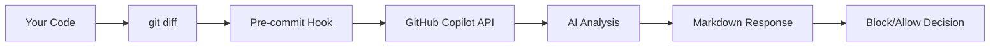

<div align="center">

# 🛡️ AI Code Review CLI

### Catch Security, Bugs & Quality Issues Before They Ship

**A portable, CLI-based AI code review system that performs comprehensive reviews at commit time—powered by GitHub Copilot.**

[](https://opensource.org/licenses/MIT)
[](https://github.com)
[](https://github.com/features/copilot)

<div align="center">


</div>

<br />

[Quick Start](#-quick-start) • [Features](#-features) • [Workflows](#-workflows) • [Configuration](#-configuration) • [Troubleshooting](#-troubleshooting)

<br />

---

</div>

## 💡 The Problem

You're about to commit code with a hardcoded password. Or a SQL injection vulnerability. Or an empty catch block. Or naming convention violations.

**Traditional code reviews catch these issues—days later.** By then, they're already in your codebase, possibly in production.

## ✅ The Solution

This tool intercepts your commits **before they happen**, analyzes your staged changes with AI, and **blocks commits that contain critical security, correctness, or quality issues**.

```
$ git commit -m "Add user authentication"

╔═══════════════════════════════════════════════════════════╗
║  ❌ AI REVIEW: COMMIT BLOCKED                             ║
╚═══════════════════════════════════════════════════════════╝

Found 2 critical issue(s):

  ❌ [BLOCK] src/main/java/UserService.java:42
     Hardcoded database password detected. Use environment 
     variables or a secure configuration management system.

  ❌ [BLOCK] src/main/java/UserService.java:89
     SQL injection vulnerability: query concatenates user input
     directly. Use PreparedStatement with parameterized queries.

Fix these issues or use 'git commit --no-verify' to bypass.
```

**Fix the issue. Commit again. Ship secure code.**

---

## 🔍 What Gets Reviewed

This isn't just a security tool—it's a comprehensive AI code reviewer using a **multi-agent architecture** where specialized agents work in parallel to analyze different aspects of your code:

**Multi-Agent System:**
- 🔒 **Security Agent**: Focuses on vulnerabilities, secrets, and security patterns
- 📝 **Naming Agent**: Checks Java naming conventions and code style
- ✅ **Quality Agent**: Reviews correctness, performance, and best practices
- 🤖 **Summarizer Agent**: Aggregates results and eliminates duplicates

**Review Categories:**

| Category | Severity | Examples |
|----------|----------|----------|
| 🔒 **Security** | BLOCK | Hardcoded secrets, SQL injection, unsafe deserialization |
| 🐛 **Correctness** | BLOCK | Null pointer risks, thread safety issues |
| ⚡ **Performance** | WARN | Inefficient collections, O(n) when O(1) available |
| 📝 **Code Quality** | WARN | Empty catch blocks, poor exception handling |
| 🎯 **Best Practices** | INFO | Naming conventions, Java code standards |

**Severity Levels:**
- **BLOCK**: Commit rejected (security & critical bugs)
- **WARN**: Commit allowed with warnings (quality issues)
- **INFO**: Commit allowed with suggestions (style & conventions)

---

## 🎯 Features

| Feature | Description |
|---------|-------------|
| 🔒 **Comprehensive Reviews** | Checks security, correctness, performance, quality, and best practices |
| 🤖 **Multi-Agent Architecture** | Specialized agents (Security, Naming, Quality) run in parallel for faster reviews |
| 🎯 **Java-Focused Checklist** | YAML-driven rules covering OWASP security + code quality standards |
| ⚡ **Reviews Only Changes** | Analyzes staged diffs, not entire files—fast and focused |
| 🧠 **AI-Powered Analysis** | Leverages GitHub Copilot for intelligent code understanding |
| 🚫 **Smart Blocking** | Only blocks BLOCK-severity issues (security/bugs), allows WARN/INFO |
| 📋 **Structured Markdown Output** | Human-readable results parsed with native tools (no jq required) |
| 🖥️ **Cross-Platform** | Native PowerShell for Windows, bash for macOS/Linux |
| 🔧 **IDE-Compatible** | Works with IntelliJ IDEA, VS Code, PyCharm, WebStorm, and any git client |
| ✏️ **Fully Customizable** | Extend the YAML checklist with your own rules |

---

## 🚀 Quick Start

### Prerequisites

<details>
<summary><strong>1. Install GitHub Copilot CLI</strong></summary>

**All platforms (requires Node.js):**
```sh
npm install -g @githubnext/github-copilot-cli
```

**Then authenticate:**
```sh
copilot auth
```

This will open a browser window to authenticate with your GitHub account (requires GitHub Copilot subscription).
</details>

### Installation

**Windows (PowerShell) - Recommended:**
```powershell
.\install.ps1
```

**macOS/Linux (bash):**
```sh
./install.sh
```

The script checks dependencies, installs the pre-commit hook, and verifies everything works.

**Manual Installation:**
```powershell
# Windows - copy the hook wrapper
Copy-Item pre-commit.ps1 -Destination . -Force
# The installer creates a bash wrapper in .git/hooks/pre-commit that calls the PowerShell script
```

```sh
# macOS/Linux
cp pre-commit.sh .git/hooks/pre-commit
chmod +x .git/hooks/pre-commit
```

### That's It!

Now every `git commit` triggers an automatic AI review:

```powershell
git add src/main/java/MyClass.java
git commit -m "Add new feature"
# AI review runs automatically ✨
```

---

## 💻 Platform Support

| Platform | Script | Notes |
|----------|--------|-------|
| **Windows** | `pre-commit.ps1` | Native PowerShell, runs parallel jobs |
| **macOS** | `pre-commit.sh` | Native bash, runs background jobs |
| **Linux** | `pre-commit.sh` | Native bash, runs background jobs |

### Windows Users

The tool runs natively in PowerShell with full feature support:
- ✅ Parallel agent execution using PowerShell jobs
- ✅ Full emoji and Unicode support
- ✅ No WSL required
- ✅ Works with any IDE (IntelliJ, VS Code, etc.)
- ✅ Works from PowerShell, CMD, or Git Bash

### Using with IDEs

**IntelliJ IDEA / PyCharm / WebStorm:**
1. Commit via IDE dialog (Ctrl+K) as normal
2. The pre-commit hook runs automatically
3. Review output appears in the IDE's console

**VS Code:**
1. Commit via Source Control panel as normal
2. The pre-commit hook runs automatically
3. Review output appears in the terminal

**Any Git Client:**
The hook works with any tool that uses git—GitHub Desktop, GitKraken, Tower, etc.

---

## 🔐 Security & Privacy

> **⚠️ Critical:** This tool sends your code to AI services. For proprietary/corporate code, you **MUST** use GitHub Copilot Business/Enterprise, Azure OpenAI, or local LLMs (Ollama). **Do NOT use free/consumer AI tiers** for confidential code.



### Enterprise vs. Consumer AI Plans

| Aspect | Enterprise/Business Plans | Individual/Free Plans |
|--------|---------------------------|----------------------|
| **Data Retention** | ✅ Prompts discarded immediately after response | ⚠️ May be retained for service improvement |
| **Training Usage** | ✅ Your code is **NOT** used for AI training | ⚠️ May be used to train/improve models |
| **Contractual Protection** | ✅ Data Processing Agreement (DPA), GDPR compliance | ⚠️ Standard consumer terms only |
| **IP Indemnification** | ✅ Often includes IP infringement protection | ❌ Typically not included |

#### ✅ Required for Proprietary Code: Secure AI Options

**For corporate/proprietary codebases, use ONLY these options:**

1. **GitHub Copilot Business/Enterprise**
   - ✅ Code is **discarded immediately** after generating response
   - ✅ **Never used to train** AI models
   - ✅ Contractual data processing agreement (DPA)
   - ✅ GDPR compliant

2. **Azure OpenAI Service**
   - ✅ Enterprise SLA (99.9% uptime)
   - ✅ Data residency options
   - ✅ Your data never leaves your Azure tenant
   - ✅ Full RBAC and compliance controls

3. **Local LLMs (Ollama + CodeLlama)**
   - ✅ Data **never leaves your machine**
   - ✅ No internet connection required
   - ✅ Complete privacy
   - ✅ No subscription costs

#### ❌ NEVER Use for Proprietary Code: Consumer AI Tiers

**Do NOT use free/individual AI plans for corporate code:**

- ❌ **GitHub Copilot Individual** - May retain prompts, different terms than Business/Enterprise
- ❌ **Free ChatGPT, Claude, etc.** - Code may be used for model training
- ❌ **Free API trials** - Limited data protection guarantees

> **Bottom line:** If you're working on proprietary code, you **MUST** use GitHub Copilot Business/Enterprise, Azure OpenAI, or local models (Ollama). Consumer/free tiers are **NOT suitable** for confidential code.

### What NOT to Send (Any AI Service)

Regardless of which tier you use, never send:

- ❌ Hardcoded secrets, API keys, or passwords
- ❌ Proprietary algorithms or trade secrets  
- ❌ Customer PII or HIPAA/GDPR protected data
- ❌ Internal infrastructure details (IPs, hostnames, internal URLs)

### Mitigation Strategies

1. **Use Enterprise AI** for corporate/proprietary codebases
2. Use `.gitignore` to exclude sensitive files
3. Use environment variables for all secrets
4. Review staged files before committing: `git diff --cached`
5. Consider **local LLMs** (Ollama, CodeLlama) for highly sensitive codebases
6. Set `AI_REVIEW_ENABLED=false` for sensitive commits

📖 **[Full Security Guide →](docs/SECURITY.md)**

---

## 📖 Workflows

### Workflow 1: The Standard Loop

> **Commit → Review → Fix → Commit**

<details>
<summary><strong>See full workflow</strong></summary>

#### Step 1: Attempt Commit
```powershell
git add src/main/java/UserService.java
git commit -m "Add user authentication"
```

#### Step 2: Review Blocked
```
╔═══════════════════════════════════════════════════════════╗
║  AI REVIEW: COMMIT BLOCKED                                ║
╚═══════════════════════════════════════════════════════════╝

  ❌ [BLOCK] src/main/java/UserService.java:23
     Hardcoded database password detected.
```

#### Step 3: Get AI-Assisted Fix

**In your IDE (VS Code, IntelliJ):**
- Open the file, select the problematic code
- Ask Copilot: *"Fix this hardcoded password using environment variables"*

**Or via CLI:**
```powershell
gh copilot suggest "How do I fix hardcoded passwords in Java using environment variables?"
```

#### Step 4: Apply the Fix
```java
// ❌ Before (BLOCKED):
private static final String DB_PASSWORD = "admin123";

// ✅ After (GOOD):
private static final String DB_PASSWORD = System.getenv("DB_PASSWORD");
```

#### Step 5: Commit Again
```powershell
git add src/main/java/UserService.java
git commit -m "Add user authentication with secure password handling"
# ✅ Review passes!
```

</details>

---

### Workflow 2: Review Past Results

```powershell
# View full review
Get-Content .ai/last_review.json

# View individual agent reports
Get-Content .ai/agents/security/review.json
Get-Content .ai/agents/naming/review.json
Get-Content .ai/agents/quality/review.json

# Search for BLOCK issues
Select-String -Path .ai/last_review.json -Pattern "\[BLOCK\]"
```

**On macOS/Linux:**
```sh
cat .ai/last_review.json
grep -A 2 '\[BLOCK\]' .ai/last_review.json
```

---

### Workflow 3: Emergency Bypass

When you absolutely must commit immediately:

```powershell
git commit --no-verify -m "Emergency hotfix for production"
```

> ⚠️ **Use sparingly!** Always track bypassed security debt:
> ```powershell
> Add-Content -Path SECURITY_DEBT.md -Value "TODO: Fix issues from $(git rev-parse HEAD)"
> ```

---

### Workflow 4: CI/CD Integration

```yaml
# .github/workflows/pr-check.yml
- name: Run AI Code Review
  shell: pwsh
  run: |
    if (-not (.\pre-commit.ps1)) {
      Write-Host "Code review failed"
      Get-Content .ai/last_review.json
      exit 1
    }
```

---

## ⚙️ Configuration

### Disable Review

```powershell
# Single commit
git commit --no-verify -m "Skip review for this commit"

# Permanently (session)
$env:AI_REVIEW_ENABLED = 'false'

# Remove hook entirely
Remove-Item .git/hooks/pre-commit
```

### Uninstall / Remove the Hook

**Windows (PowerShell):**
```powershell
Remove-Item .git\hooks\pre-commit
```

**macOS/Linux:**
```sh
rm .git/hooks/pre-commit
```

### Customize Checklist

Edit `.ai/java_code_review_checklist.yaml`:

```yaml
rules:
  - id: custom-rule-001
    description: "Check for deprecated API usage"
    severity: WARN  # BLOCK | WARN | INFO
```

### Severity Levels

| Severity | Effect | Example Issues |
|----------|--------|----------------|
| `BLOCK` | ❌ Prevents commit | Hardcoded secrets, SQL injection, null pointer risks |
| `WARN` | ⚠️ Allows commit, shows warning | Poor exception handling, performance issues |
| `INFO` | ℹ️ Allows commit, shows info | Naming convention violations |

### Environment Variables

| Variable | Default | Description |
|----------|---------|-------------|
| `AI_REVIEW_ENABLED` | `true` | Set to `false` to skip AI review |
| `SKIP_SENSITIVE_CHECK` | `false` | Skip sensitive data warning prompt |
| `FORCE_COLOR` | `false` | Force colored output (bash only) |

---

## 📁 Project Structure

```
.
├── pre-commit.ps1                         # PowerShell pre-commit hook (Windows)
├── pre-commit.sh                          # Bash pre-commit hook (macOS/Linux)
├── install.ps1                            # PowerShell installation script
├── install.sh                             # Bash installation script
├── LICENSE                                # MIT License
├── .ai/
│   ├── agents/                           # Multi-agent system
│   │   ├── security/                     # Security agent
│   │   ├── naming/                       # Naming conventions agent
│   │   ├── quality/                      # Code quality agent
│   │   └── summarizer/                   # Results aggregator
│   ├── java_code_review_checklist.yaml   # Review rules (YAML)
│   ├── java_review_prompt.txt            # AI prompt template
│   └── last_review.json                  # Last review results
├── docs/
│   ├── ARCHITECTURE.md                   # System design
│   ├── SECURITY.md                       # Security guide
│   └── linked_image.png                  # Project image
├── examples/
│   ├── BadClass.java                     # Example with intentional issues
│   ├── a.java                            # Simple example file
│   └── README.md                         # Examples documentation
└── README.md
```

---

## 🔍 Troubleshooting

<details>
<summary><strong>"GitHub CLI (gh) not found"</strong></summary>

Install GitHub CLI for your platform:
```powershell
# Windows
winget install --id GitHub.cli

# Or with Chocolatey
choco install gh

# Or with Scoop
scoop install gh
```

```sh
# macOS
brew install gh

# Linux
# See https://github.com/cli/cli/blob/trunk/docs/install_linux.md
```
</details>

<details>
<summary><strong>"GitHub Copilot CLI extension not installed"</strong></summary>

```sh
gh extension install github/gh-copilot
```
</details>

<details>
<summary><strong>"Could not connect to GitHub Copilot"</strong></summary>

1. Ensure you're authenticated: `gh auth login`
2. Check your GitHub Copilot subscription
3. Verify extension: `gh extension list`
</details>

<details>
<summary><strong>Hook not running</strong></summary>

**Windows:**
```powershell
# Check if hook exists
Test-Path .git/hooks/pre-commit

# Re-run installer
.\install.ps1
```

**macOS/Linux:**
```sh
# Check if executable
ls -la .git/hooks/pre-commit

# Make executable
chmod +x .git/hooks/pre-commit
```
</details>

<details>
<summary><strong>Review takes too long</strong></summary>

- Large diffs (>20KB) are automatically truncated
- Consider smaller, focused commits
- Bypass for large refactors: `git commit --no-verify`
</details>

<details>
<summary><strong>PowerShell execution policy error</strong></summary>

```powershell
# Allow script execution for current user
Set-ExecutionPolicy -ExecutionPolicy RemoteSigned -Scope CurrentUser
```
</details>

<details>
<summary><strong>"Too many arguments" or argument length errors (Windows)</strong></summary>

Windows has a command-line argument length limit of ~8,191 characters. The PowerShell script automatically handles this by:
1. Checking prompt length before invocation
2. Using stdin piping (`copilot -p -`) for large prompts
3. Writing prompts to temp files when needed

If you still encounter issues:
```powershell
# Reduce diff size by committing smaller changes
git add -p  # Stage partial changes

# Or increase MAX_DIFF_SIZE in pre-commit.ps1 if your prompts are within limits
# Default: $MAX_DIFF_SIZE = 20000  (bytes)
# Default: $MAX_ARG_LENGTH = 7000  (characters)
```
</details>

---

## 📄 License

MIT License - See [LICENSE](LICENSE) for details.

---

