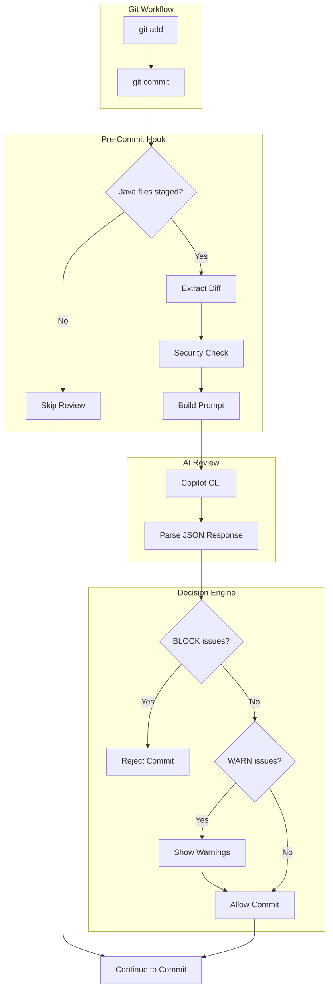
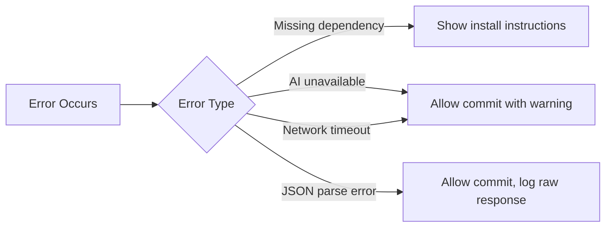

# Architecture Overview

This document describes the system design and data flow of the CLI-Based AI Java Code Review system.

## System Components



## File Responsibilities

| File | Purpose | Type |
|------|---------|------|
| `pre-commit.sh` | Hook entry point, orchestrates the review workflow | Executable |
| `.ai/java_code_review_checklist.yaml` | Review rules configuration with OWASP references | Config |
| `.ai/java_review_prompt.txt` | AI prompt template with security boundaries | Template |
| `.ai/last_review.json` | Most recent review output (generated) | Output |
| `.ai/last_review_raw.txt` | Raw AI response for debugging (generated) | Debug |
| `install.sh` | One-command setup for hook installation | Executable |

## Data Flow

### 1. Input Stage
- **Trigger**: `git commit` command
- **Filter**: Only `.java` files in staged changes
- **Extract**: `git diff --cached` for staged Java files only

### 2. Security Pre-Check
- Scan diff for sensitive keywords (password, secret, api_key, etc.)
- Warn user if potential sensitive data detected
- User can abort or continue

### 3. Prompt Composition
```
┌─────────────────────────────────────────┐
│ Prompt Template (.ai/java_review_prompt.txt)  │
│   + Checklist Rules (YAML)              │
│   + Git Diff Content                    │
│   = Complete Review Prompt              │
└─────────────────────────────────────────┘
```

### 4. AI Analysis
- Send composed prompt to GitHub Copilot CLI
- Receive JSON response with issues
- Parse and validate JSON structure

### 5. Decision Engine
```
BLOCK issues found? → Reject commit, show errors
Only WARN/INFO?    → Allow commit, show warnings
No issues?         → Allow commit silently
```

## Configuration Points

| Setting | Location | Default | Description |
|---------|----------|---------|-------------|
| `AI_REVIEW_ENABLED` | Environment | `true` | Enable/disable review |
| `SKIP_SENSITIVE_CHECK` | Environment | `false` | Skip sensitive data warning |
| `MAX_DIFF_SIZE` | `pre-commit.sh` | 20000 bytes | Maximum diff size |
| `FORCE_COLOR` | Environment | `false` | Force colored output |

## Error Handling



## Security Boundaries

The system implements multiple security layers:

1. **Input Sanitization**: Diff content treated as untrusted data
2. **Prompt Injection Protection**: AI instructed to ignore embedded commands
3. **Output Redaction**: AI instructed to never echo sensitive values
4. **Pre-flight Check**: Warn users about sensitive data before sending

## Extension Points

To extend the system:

1. **Add rules**: Edit `.ai/java_code_review_checklist.yaml`
2. **Modify prompt**: Edit `.ai/java_review_prompt.txt`
3. **Change AI provider**: Modify the Copilot CLI call in `pre-commit.sh`
4. **Add languages**: Create new checklist/prompt files and update hook
