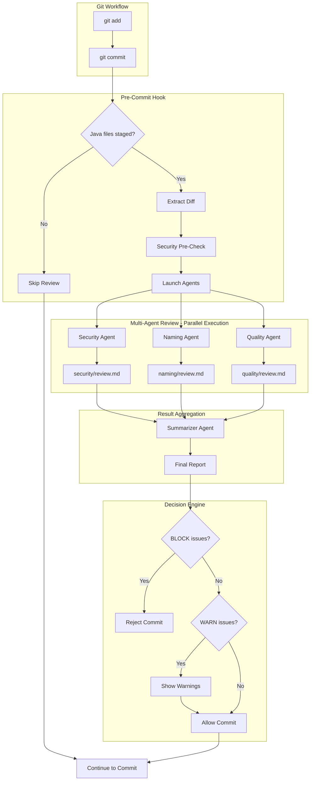
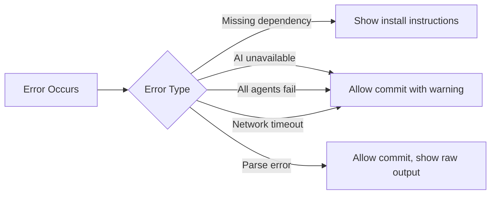

# Architecture Overview

This document describes the system design and data flow of the CLI-Based AI Java Code Review system with **multi-agent architecture**.

## System Components



## Multi-Agent Architecture

The system uses 4 specialized agents running in parallel for faster, more thorough reviews:

| Agent | Focus | Severity | Parallel |
|-------|-------|----------|----------|
| **Security Agent** | OWASP Top 10, hardcoded secrets, injection attacks | BLOCK | Yes |
| **Naming Agent** | Java naming conventions (PascalCase, camelCase) | INFO | Yes |
| **Quality Agent** | NPE risks, thread safety, exception handling | BLOCK/WARN | Yes |
| **Summarizer Agent** | Aggregates, deduplicates, prioritizes findings | N/A | No (runs after others) |

**Performance**: ~3x faster than sequential execution (~15s vs ~45s)

## Platform Support

| Platform | Script | Parallel Execution |
|----------|--------|--------------------|
| **Windows** | `pre-commit.ps1` | PowerShell Jobs (`Start-Job`) |
| **macOS** | `pre-commit.sh` | Background processes (`&`) |
| **Linux** | `pre-commit.sh` | Background processes (`&`) |

## File Responsibilities

| File | Purpose | Type |
|------|---------|------|
| `pre-commit.ps1` | Hook entry point for Windows (PowerShell) | Executable |
| `pre-commit.sh` | Hook entry point for macOS/Linux (bash) | Executable |
| `install.ps1` | Windows installation script | Executable |
| `install.sh` | macOS/Linux installation script | Executable |
| `.ai/agents/security/checklist.yaml` | Security rules (OWASP) | Config |
| `.ai/agents/security/prompt.txt` | Security agent prompt | Template |
| `.ai/agents/naming/checklist.yaml` | Naming convention rules | Config |
| `.ai/agents/naming/prompt.txt` | Naming agent prompt | Template |
| `.ai/agents/quality/checklist.yaml` | Code quality rules | Config |
| `.ai/agents/quality/prompt.txt` | Quality agent prompt | Template |
| `.ai/agents/summarizer/prompt.txt` | Summarizer prompt | Template |
| `.ai/agents/*/review.md` | Agent outputs (markdown format) | Output |
| `.ai/last_review.json` | Final aggregated review | Output |

**Note**: Agent output files use `.json` extension for historical reasons but contain markdown format.

## Data Flow

### 1. Input Stage
- **Trigger**: `git commit` command
- **Filter**: Only `.java` files in staged changes
- **Extract**: `git diff --cached` for staged Java files only

### 2. Security Pre-Check
- Scan diff for sensitive keywords (password, secret, api_key, etc.)
- Warn user if potential sensitive data detected
- User can abort or continue

### 3. Multi-Agent Analysis (Parallel)

```
┌─────────────────────────────────────────────────────────────┐
│                    PARALLEL EXECUTION                        │
├─────────────────┬─────────────────┬─────────────────────────┤
│ Security Agent  │ Naming Agent    │ Quality Agent           │
│ + checklist     │ + checklist     │ + checklist             │
│ + prompt        │ + prompt        │ + prompt                │
│ + diff          │ + diff          │ + diff                  │
│       ↓         │       ↓         │       ↓                 │
│ review.md       │ review.md       │ review.md               │
└─────────────────┴─────────────────┴─────────────────────────┘
                            │
                            ↓
              ┌─────────────────────────┐
              │   Summarizer Agent      │
              │   - Aggregate reports   │
              │   - Deduplicate issues  │
              │   - Prioritize by       │
              │     severity            │
              └───────────┬─────────────┘
                          ↓
              ┌─────────────────────────┐
              │   last_review.json      │
              │   (Final Report)        │
              └─────────────────────────┘
```

### 4. Decision Engine
```
BLOCK issues found? → Reject commit, show errors
Only WARN/INFO?    → Allow commit, show warnings
No issues?         → Allow commit silently
```

## Configuration Points

| Setting | Location | Default | Description |
|---------|----------|---------|-------------|
| `AI_REVIEW_ENABLED` | Environment | `true` | Enable/disable review |
| `SKIP_SENSITIVE_CHECK` | Environment | `false` | Skip sensitive data warning |
| `MAX_DIFF_SIZE` | Script | 20000 bytes | Maximum diff size |
| `FORCE_COLOR` | Environment | `false` | Force colored output (bash) |

## Error Handling



## Security Boundaries

The system implements multiple security layers:

1. **Input Sanitization**: Diff content treated as untrusted data
2. **Prompt Injection Protection**: AI instructed to ignore embedded commands
3. **Output Redaction**: AI instructed to never echo sensitive values
4. **Pre-flight Check**: Warn users about sensitive data before sending

## Extension Points

To extend the system:

1. **Add a new agent**: Create `.ai/agents/<name>/` with `checklist.yaml` and `prompt.txt`
2. **Modify rules**: Edit `checklist.yaml` in any agent directory
3. **Customize prompts**: Edit `prompt.txt` in any agent directory
4. **Change AI provider**: Modify the Copilot CLI call in `pre-commit.ps1` or `pre-commit.sh`
5. **Add languages**: Create new agent configurations for other languages

## Windows Implementation Details

The PowerShell implementation (`pre-commit.ps1`) uses:

- **PowerShell Jobs** for parallel agent execution
- **Start-Job** / **Wait-Job** / **Receive-Job** pattern
- **Temporary files** for passing diff content to jobs
- **UTF-8 encoding** throughout for proper Unicode support

```powershell
# Example: Parallel agent execution
$SecurityJob = Start-Job -ScriptBlock { ... } -ArgumentList $args
$NamingJob = Start-Job -ScriptBlock { ... } -ArgumentList $args
$QualityJob = Start-Job -ScriptBlock { ... } -ArgumentList $args

Wait-Job -Job @($SecurityJob, $NamingJob, $QualityJob) -Timeout 120
```

## macOS/Linux Implementation Details

The bash implementation (`pre-commit.sh`) uses:

- **Background processes** for parallel agent execution
- `&` operator and `wait` command
- **Trap handlers** for cleanup on exit
- **POSIX-compliant** syntax for maximum portability

```bash
# Example: Parallel agent execution
run_agent "security" "$DIFF_CONTENT" &
SECURITY_PID=$!
run_agent "naming" "$DIFF_CONTENT" &
NAMING_PID=$!
run_agent "quality" "$DIFF_CONTENT" &
QUALITY_PID=$!

wait $SECURITY_PID $NAMING_PID $QUALITY_PID
```
